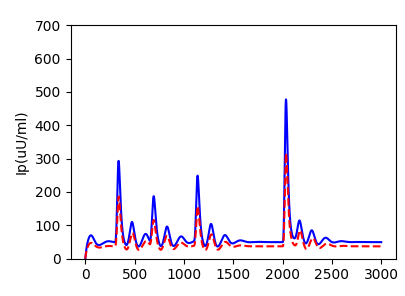
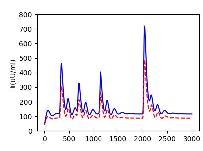
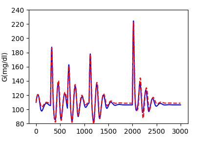
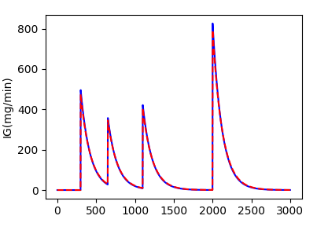
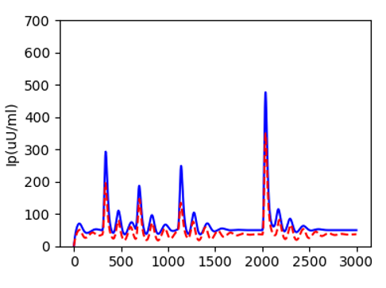
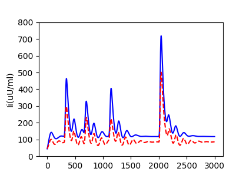
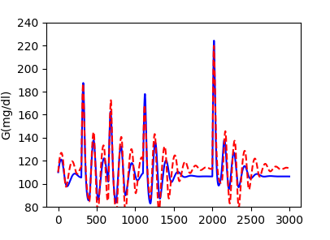
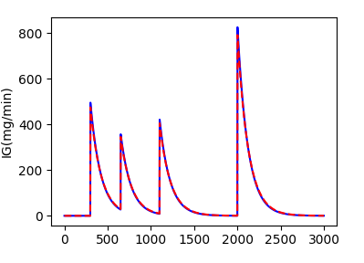

# sbinn_paddle

## 目录


- [1. 简介]()
- [2. 复现精度]()
- [3. 准备环境]()
- [4. 开始使用]()
- [5. LICENSE]()
- [6. 参考链接与文献]()


## 1. 简介

本项目为使用paddle复现sbinn项目。

**论文:** [Lettuce: PyTorch-based Lattice Boltzmann Framework](https://arxiv.org/pdf/2106.12929.pdf)

**参考repo:** [https://github.com/lu-group/sbinn](https://github.com/lu-group/sbinn)
                                        
快速使用可参考[AIStudio]()        

感谢百度飞桨提供的算力支持


## 2. 复现精度

论文fig13复现结果：

epoch=400000:
<div>
    
    
</div>     
<div>
    
    
</div> 

<div>
</div> 
epoch=600000:
<div>
    
    
</div>     
<div>
    
    
</div> 

ps:由于模型输入为在特定数据中随机选取1/5，所以每次运行结果会有一定差异


训练日志,以及生成的variable.csv,vallist.csv可在[BaiduYun](https://www.paddlepaddle.org.cn/)下载

## 3. 准备环境

* 下载代码

```bash
git clone https://github.com/simonsLiang/sbinn_paddle
```

* 安装paddlepaddle

```bash
# 需要安装2.1.2的Paddle版本
# 安装GPU版本的Paddle
pip install paddlepaddle-gpu==2.1.2
```
                                            
更多安装方法可以参考：[Paddle安装指南](https://www.paddlepaddle.org.cn/)


## 4. 开始使用

此部分可参考[AIStudio]()       
运行以下命令生成数据                                            
```bash
python  data_generation.py                                           
```   
                                            
然后运行以下命令训练模型和参数                                        
```bash
python  sbinn_paddle.py                                           
```                                          

训练完成后得到variable.csv文件,再运行以下命令得到最终的生成参数，保存于vallist.csv文件中                                                  
```bash
python  variable_to_parameter_transform.py                                        
```  
                                            
接着利用生成的参数得到预测数据                                                  
```bash
python  data_prediction.py                                           
```     
            
最后对预测数据与原数据进行绘图对比                                               
```bash
python  plot.py                                           
```                                                                                     

## 5. LICENSE

[Apache License 2.0](./LICENSE)


## 6. 参考链接与文献
[Lettuce: PyTorch-based Lattice Boltzmann Framework](https://arxiv.org/pdf/2106.12929.pdf)
